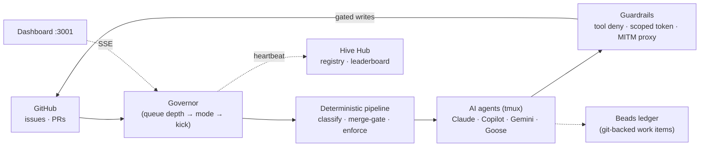

# Hive

[](https://hub.tunaos.org)
[](https://tunaos.org)
[](https://www.bestpractices.dev/projects/14261)
[](LICENSE)

> This repository is a fork of [`hivecommons/hive`](https://github.com/hivecommons/hive)
> that Tuna OS runs against its own repositories. Bugs, features, and security
> reports for Hive itself go upstream — see [FORK.md](FORK.md) for what belongs
> where and which documents here describe upstream rather than this fork.

AI agent orchestration for open source projects. A single Go binary enumerates GitHub issues and PRs, classifies them by complexity, and dispatches work to AI agents (Claude, Copilot, Gemini, Goose) on adaptive cadences governed by queue depth.

Hive separates decisions into two layers: a **deterministic pipeline** of shell scripts handles filtering, classification, merge-gating, and enforcement before any LLM sees the work. Agents only handle judgment calls — reading code, reasoning about fixes, writing PRs.

## Quick Start

Two supported standalone runtimes. **Docker Compose is the default** and is what
the rest of this README assumes; **Podman** is a parallel supported choice, not
an experiment and not a recommendation over Docker. Pick one — they install the
same two services (Hive plus its authenticating gateway) and land the dashboard
on the same port.

| | [Docker Compose](#quick-start-docker-compose) | [Podman](#quick-start-podman) |
| --- | --- | --- |
| Lifecycle | `docker compose up -d` | Quadlet units under systemd |
| Runs as | the Docker daemon | rootful **or** rootless |
| Update path | pull and recreate; optional Watchtower profile | [pinned by digest, with rollback](src/docs/podman-quadlet-update-rollback.md) |

## Quick Start (Docker Compose)

**Prerequisites**

- Docker Engine 24+ with the Compose v2 plugin (`docker compose`, not the legacy `docker-compose`)
- A Linux, macOS, or Windows (WSL2) host on `amd64` or `arm64` — the pre-built images are multi-arch
- `git`, `openssl`, and a GitHub token (PAT or App) for the org you want the hive to work on

```bash
git clone https://github.com/hivecommons/hive.git
cd hive

cp src/hive.yaml.example src/hive.yaml

# src/.env, NOT ./.env. `-f src/docker-compose.yaml` makes `src/` the project
# directory, and that is where Compose reads `.env` from — the same place the
# compose file's own `./hive.yaml` and `./secrets` mounts resolve against. A
# `.env` at the repo root is read by nothing, and since both paths are
# gitignored, neither git nor Compose says so: the hive starts and then 401s on
# every GitHub call, which reads like a bad token rather than an unread file.
echo "HIVE_GITHUB_TOKEN=ghp_..." > src/.env   # classic PAT: repo scope (see src/docs/github-app-setup.md#personal-access-token-pat-scopes)

# REQUIRED. The dashboard's auth proxy enforces this token and refuses to start
# without one, so the gateway on :3001 would proxy to a port nothing is
# listening on. See src/deploy/quadlet/hive.env.example, which is the contract
# for both runtimes.
printf 'HIVE_DASHBOARD_TOKEN=%s\n' "$(openssl rand -hex 32)" >> src/.env

docker compose -f src/docker-compose.yaml up -d
```

Dashboard at `http://localhost:3001`. Confirm it end to end rather than assuming
the port answers — the gateway publishes 3001 whether or not the proxy behind it
came up:

```bash
curl -sf http://127.0.0.1:3001/api/health     # -> {"status":"ok"}
```

The pre-built image tag is documented in [src/docs/operator-reference.md#image-provenance-and-tags](src/docs/operator-reference.md#image-provenance-and-tags). Standalone image references come from one source of truth, [`src/deploy/standalone-images.sh`](src/deploy/standalone-images.sh).

To build from source instead of pulling the pre-built image:

```bash
docker compose -f src/docker-compose.yaml build
docker compose -f src/docker-compose.yaml up -d
```

## Quick Start (Podman)

Same two services as the Compose stack, run as systemd units through Quadlet, so
`systemctl start` returning means Hive answered `/api/health` rather than merely
that a process was spawned. Docker is not required and is not used.

**Prerequisites**

- **Podman 5.0.0+** (ADR-0017 recommends **5.6.0**; the verified floor is
  unknown — see [the requirements note](src/docs/podman-standalone-quadlet.md#requirements))
- **systemd**, and **cgroup v2** — `podman info --format '{{.Host.CgroupsVersion}}'`
- The **Quadlet generator** at `/usr/libexec/podman/quadlet`. It ships with the
  distribution `podman` package; a hand-installed podman binary may not carry it.
- **`aardvark-dns`** — `podman info --format '{{.Host.NetworkBackend}}'` should
  say `netavark`. Without it the gateway starts and cannot resolve `hive`, so
  `:3001` serves 502s.
- `git`, `openssl`, and a GitHub token (PAT or App) for the org the hive works on

### One command

`bin/hive-podman-setup.sh` does everything in the manual sequence below —
preflights, configuration, the four Quadlet units, the boot wiring, and a final
check that the **gateway** answers on the published port before it returns.

```bash
git clone https://github.com/hivecommons/hive.git
cd hive

export HIVE_DEPLOY_RUNTIME=podman
bin/hive-podman-setup.sh --rootless        # or --rootful
```

It installs no packages and clones nothing, is idempotent, never overwrites an
existing config without `--force` and never touches `secrets/`. A failing step
stops the run and names itself; nothing is rolled back, so the partial state is
there to inspect. It also enforces three couplings that are easy to get wrong by
hand:

- `dashboard.port` is read out of the unit that will enforce it, and the run
  stops if the config does not read back agreeing — the 300-second silent hang
  the manual block warns about below.
- the volume is created **through its unit**, so it carries the ownership labels
  that make `bin/hive-podman-teardown.sh` able to see it.
- the secrets directory gets the right ownership for the root mode, and rootless
  installs are told when lingering is off and the deployment will not survive a
  reboot.

Add `--enable-linger` to fix that last one during the install rather than after.

### Or, by hand

Worth reading even if you use the script: the comments below are where the traps
are documented, and the script enforces the same ones.

The block below is **rootless**. For rootful, set `CONF=/etc/hive`, drop the
`podman unshare` line in favour of the `chgrp` beside it, install the units into
`/etc/containers/systemd/` with `sudo`, and drop `--user` from every `systemctl`.

```bash
# Selects the Podman path. WITHOUT THIS the preflights below exit 0 having
# checked nothing — they default to Docker and skip.
export HIVE_DEPLOY_RUNTIME=podman

git clone https://github.com/hivecommons/hive.git
cd hive

# Engine, root mode, cgroups; then subordinate IDs, graphroot, networking.
# A missing subuid range or cgroup v1 host fails HERE rather than as a start
# that times out five minutes later.
bin/hive-podman-preflight.sh
bin/hive-podman-preflight-ids.sh

CONF=~/.config/hive                       # rootful: CONF=/etc/hive
mkdir -p "$CONF/secrets" && chmod 750 "$CONF/secrets"
podman unshare chown -R 0:1002 "$CONF/secrets"    # rootful: chgrp -R 1002 "$CONF/secrets"

cp src/hive.yaml.example "$CONF/hive.yaml"
# REQUIRED. The example ships 3001 for local source runs; the unit's healthcheck
# probes 3002. Keeping 3001 costs a silent 300-second hang with no container
# left to inspect.
sed -i 's/^  port: 3001$/  port: 3002/' "$CONF/hive.yaml"
# then edit the rest of "$CONF/hive.yaml" for your project

cp src/deploy/nginx.conf "$CONF/nginx.conf"

# Must EXIST, even if every line stays commented out: EnvironmentFile= becomes
# `podman run --env-file`, which fails on a missing file.
cp src/deploy/quadlet/hive.env.example "$CONF/hive.env"
chmod 600 "$CONF/hive.env"
printf 'HIVE_DASHBOARD_TOKEN=%s\n' "$(openssl rand -hex 32)" >> "$CONF/hive.env"
# Classic PAT: `repo` scope (`public_repo` for public-only), plus `workflow` at
# L5/L6 if agent PRs may touch `.github/workflows/`. See
# src/docs/github-app-setup.md#personal-access-token-pat-scopes
printf 'HIVE_GITHUB_TOKEN=%s\n'    'ghp_...'                 >> "$CONF/hive.env"

# Now the host preflight, which checks what the steps above just created:
# SELinux labels on the bind sources, secrets reachability, hive.env, port 3001.
HIVE_SRC_DIR="$CONF" bin/hive-podman-preflight-host.sh

# Pull before starting. The generated ExecStart pulls a missing image itself and
# that pull is spent inside TimeoutStartSec; the Hive image is ~3.8GB.
podman pull ghcr.io/hivecommons/hive:stable

# All four Quadlet units — the gateway will not generate without the network it
# names — plus the plain units that wire the stack to boot (#4478).
install -Dm644 src/deploy/quadlet/hive.container         ~/.config/containers/systemd/hive.container
install -Dm644 src/deploy/quadlet/hive-data.volume       ~/.config/containers/systemd/hive-data.volume
install -Dm644 src/deploy/quadlet/hive.network           ~/.config/containers/systemd/hive.network
install -Dm644 src/deploy/quadlet/hive-gateway.container ~/.config/containers/systemd/hive-gateway.container
install -Dm644 src/deploy/systemd/hive-boot.target       ~/.config/systemd/user/hive-boot.target
install -Dm644 src/deploy/systemd/hive-boot-gate.service ~/.config/systemd/user/hive-boot-gate.service
systemctl --user daemon-reload
systemctl --user enable hive-boot-gate.service

# Starting the gateway pulls Hive, the network and the volume up in order.
systemctl --user start hive-gateway.service
```

Dashboard at `http://localhost:3001`, the same port and the same single
published port as the Compose stack — Hive's own 3001/3002 and the raw ttyd
terminal on 7681 stay inside the container network. Confirm the stack end to
end, which also proves the gateway resolved `hive` over the shared network:

```bash
curl -sf http://127.0.0.1:3001/api/health     # -> {"status":"ok"}

# Post-install verification. Healthy NOW is not the same as back after a
# reboot: this is what catches rootless Linger=no, which nothing else reports.
bin/hive-podman-lifecycle-probe.sh check
```

`daemon-reload` runs the generator, and `[Install] WantedBy=hive-boot.target`
inside the units is half of what wires them to boot; the other half is
`hive-boot-gate.service` — the one real (enableable) unit, so the `enable`
above works and is required. **Rootless additionally needs
`loginctl enable-linger "$USER"`** or the user manager never starts at boot.
Check with `bin/hive-podman-lifecycle-probe.sh check`, not with
`systemctl is-enabled hive.service`, which reports `generated` either way.

The gate is why booting never waits on Hive: it starts `hive-boot.target` only
after systemd declares startup finished, so a Hive that cannot become healthy
costs itself its `TimeoutStartSec` — not the host's boot, in either root mode.
Before #4478 a rootful Hive sat inside the boot transaction and a broken one
held the boot for up to five minutes, on every boot, until fixed. Measured,
including the fix:
[Boot persistence](src/docs/podman-standalone-quadlet.md#4-boot-persistence).

**Security posture — pick deliberately.** The shipped unit requests
`CAP_NET_ADMIN`, so the forced-proxy egress gate is *enforced* by default. Where
that capability is unavailable, `HIVE_PROXY_ADVISORY_OK=true` in `$CONF/hive.env`
starts Hive with the gate **not installed**; without either, Hive refuses to
start with exit 77 rather than running an unenforced capability model.

| | Enforcing (default) | Advisory (`HIVE_PROXY_ADVISORY_OK=true`) |
| --- | --- | --- |
| **Rootful** | **Supported** | Supported as a deliberate choice, **unenforced** |
| **Rootless** | **Supported** (needs `loginctl enable-linger` to survive reboot) | Supported as a deliberate choice, **unenforced** |

Advisory mode is **not** a weaker grade of enforcing and **not** a fallback:
agents can bypass the MITM proxy and the ACMM capability model is not enforced.
Choose it knowingly. Full matrix and the evidence behind each cell:
[src/docs/podman-support-matrix.md](src/docs/podman-support-matrix.md).

To build from source instead of pulling the pre-built image, build and tag it
under the name the unit already names, then start as above:

```bash
podman build -t ghcr.io/hivecommons/hive:stable -f src/Dockerfile .
```

Full install detail — unit search paths, the traps behind each step above, boot
persistence, and what was measured in both root modes — is in
**[src/docs/podman-standalone-quadlet.md](src/docs/podman-standalone-quadlet.md)**.
Update and rollback: [src/docs/podman-quadlet-update-rollback.md](src/docs/podman-quadlet-update-rollback.md).
Teardown: `bin/hive-podman-teardown.sh`.

## Kubernetes Deployment

### Prerequisites

- `kubectl` configured for your cluster
- Kubernetes 1.24+
- A StorageClass that supports `ReadWriteMany` (NFS recommended for zero-downtime rollouts)
- cert-manager (for TLS certificates)
- nginx-ingress (for ingress routing)

### Hosted Option

The [Hive Hub](https://hive.hivecommons.dev) provides hosted hives with OAuth-protected dashboards, a public registry, and cross-hive leaderboards. No cluster required.
The canonical hub address is now `https://hive.hivecommons.dev`; the legacy
`https://hive.kubestellar.io` hostname redirects during the cutover.
Start with the [hosted hub onboarding guide](src/docs/hosted-hub.md) to sign in,
request a hosted hive, and finish first-run setup.

If you need to run your own private hub instead, see the
[self-hosted hub deployment guide](src/docs/hub-deployment.md).

### Self-Hosted Deployment

#### 1. Create the namespace

```bash
kubectl apply -f src/deploy/k8s/namespace.yaml
```

Or manually:

```bash
kubectl create namespace hive
```

#### 2. Create secrets

```bash
kubectl -n hive create secret generic hive-secrets \
  --from-literal=HIVE_GITHUB_TOKEN=ghp_... \
  --from-literal=HIVE_DASHBOARD_TOKEN="$(openssl rand -hex 32)"
```

The PAT needs the classic `repo` scope (`public_repo` for public-only repos),
plus `workflow` at L5/L6 if agent PRs may touch `.github/workflows/`. Scopes are
never validated at startup, so a wrong-scoped token fails later as a generic
GitHub 403 — see [Personal access token (PAT) scopes](src/docs/github-app-setup.md#personal-access-token-pat-scopes).

The dashboard token is an opaque shared secret with no server-side strength
check — always generate it with a CSPRNG as above, never a hand-typed value.
See [Generating and rotating `HIVE_DASHBOARD_TOKEN`](src/docs/env-vars.md#generating-and-rotating-hive_dashboard_token).

For GitHub App auth (recommended for production), add the private key:

```bash
kubectl -n hive create secret generic hive-secrets \
  --from-literal=HIVE_GITHUB_TOKEN=ghp_... \
  --from-file=gh-app-key.pem=/path/to/key.pem
```

With `github.app_id`/`key_file` set, the App path supplies repository
permissions and the PAT is only a fallback; see
[GitHub App setup](src/docs/github-app-setup.md) for both paths.

#### 3. Create ConfigMap from hive.yaml

```bash
cp src/hive.yaml.example hive.yaml
# Edit hive.yaml: set your org, repos, agents, and governor config

kubectl create configmap hive-config -n hive --from-file=hive.yaml=hive.yaml
```

#### 4. Create PersistentVolumeClaim

Apply the provided PVC manifest:

```bash
kubectl apply -f src/deploy/k8s/pvc.yaml
```

The default PVC requests 10Gi with `ReadWriteOnce`. For zero-downtime rollouts with rolling updates, use an NFS-backed StorageClass with `ReadWriteMany`:

```yaml
apiVersion: v1
kind: PersistentVolumeClaim
metadata:
  name: hive-data
  namespace: hive
spec:
  accessModes:
    - ReadWriteMany
  storageClassName: nfs
  resources:
    requests:
      storage: 10Gi
```

#### 5. Deploy

```bash
kubectl apply -f src/deploy/k8s/deployment.yaml
kubectl apply -f src/deploy/k8s/service.yaml
```

The deployment runs a single replica with liveness and readiness probes on `/api/health`. Resource defaults: 500m CPU / 512Mi memory (requests), 2 CPU / 2Gi memory (limits).

#### 6. Set up Ingress with TLS

```yaml
apiVersion: networking.k8s.io/v1
kind: Ingress
metadata:
  name: hive
  namespace: hive
  annotations:
    cert-manager.io/cluster-issuer: letsencrypt-prod
    nginx.ingress.kubernetes.io/proxy-body-size: "50m"
    nginx.ingress.kubernetes.io/proxy-read-timeout: "3600"
    nginx.ingress.kubernetes.io/proxy-send-timeout: "3600"
spec:
  ingressClassName: nginx
  tls:
    - hosts:
        - hive.example.com
      secretName: hive-tls
  rules:
    - host: hive.example.com
      http:
        paths:
          - path: /
            pathType: Prefix
            backend:
              service:
                name: hive
                port:
                  name: dashboard
```

Long timeouts are needed for SSE streaming connections to the dashboard.

#### Quick apply (all manifests)

```bash
kubectl apply -f src/deploy/k8s/namespace.yaml
kubectl -n hive create secret generic hive-secrets \
  --from-literal=HIVE_GITHUB_TOKEN=ghp_...   # classic PAT: repo scope — see src/docs/github-app-setup.md#personal-access-token-pat-scopes
kubectl create configmap hive-config -n hive --from-file=hive.yaml=hive.yaml
kubectl apply -f src/deploy/k8s/pvc.yaml
kubectl apply -f src/deploy/k8s/deployment.yaml
kubectl apply -f src/deploy/k8s/service.yaml
```

### Ports

| Port | Purpose |
|------|---------|
| 3001 | Dashboard (supports auth token) |
| 3002 | Internal API |
| 7681 | ttyd web terminal |

### Volumes

| Mount Path | Purpose |
|------------|---------|
| `/etc/hive/hive.yaml` | Configuration (read-only, from ConfigMap) |
| `/data` | Persistent state: metrics, beads, logs |
| `/secrets` | GitHub App key and other secrets (read-only) |

## Configuration

All runtime config lives in a single `hive.yaml`. Environment variables are interpolated with `${VAR}` syntax. See [src/hive.yaml.example](src/hive.yaml.example) for the full reference, [src/docs/env-vars.md](src/docs/env-vars.md) for the centralized environment variable reference, [src/docs/agent-configuration.md](src/docs/agent-configuration.md) for agent configuration, [src/AGENT-DEFINITION.md](src/AGENT-DEFINITION.md) for the portable agent YAML format, [src/docs/supervisor.md](src/docs/supervisor.md) for the supervisor agent, [src/docs/telemetry.md](src/docs/telemetry.md) and [src/docs/operations.md](src/docs/operations.md) for the L5/L6-only opt-in observability and operational-readiness agents, [docs/backend-setup.md](docs/backend-setup.md) for CLI backends, [docs/inference-backends.md](docs/inference-backends.md) for model gateways, [docs/migration-v1-v2.md](docs/migration-v1-v2.md) for v1→v2 migration, and [src/docs/migration-v2-v4.md](src/docs/migration-v2-v4.md) for upgrading a v2 deployment to v4.

The top-level deterministic shell pipeline uses a separate project file,
`config/hive-project.yaml.example`; see [config/README.md](config/README.md)
before running the top-level `bin/` scripts directly.

```yaml
project:
  org: your-org
  repos:
    - repo-one
    - repo-two
  primary_repo: repo-one
  ai_author: your-bot-user

agents:
  scanner:
    enabled: true
    backend: claude
    model: claude-sonnet-4-6
    beads_dir: /data/beads/scanner
    clear_on_kick: true

governor:
  eval_interval_s: 300
  modes:
    surge:
      threshold: 20
      scanner: 15m
      reviewer: pause
    busy:
      threshold: 10
      scanner: 15m
      reviewer: 1h
    quiet:
      threshold: 2
      scanner: 15m
      reviewer: 45m
    idle:
      threshold: 0
      scanner: 15m
      reviewer: 15m

hub:
  enabled: true
  url: https://hive.hivecommons.dev
  contribute:
    enabled: true
```

### GitHub Auth

Use a personal access token or a GitHub App:

```yaml
github:
  token: ${HIVE_GITHUB_TOKEN}
```

```yaml
github:
  app_id: 12345
  installation_id: 67890
  key_file: /secrets/gh-app-key.pem
```

## ACMM Levels

Hive uses an **AI-native Capability Maturity Model** (ACMM) with six levels that control what agents are allowed to do:

| Level | Name | Agents | What agents can do |
|-------|------|--------|-------------------|
| L1 | Inception (Assisted) | 2 | Interactive advisor and project inception. Advisory beads only. |
| L2 | Advisory (Instructed) | 5 | Observe and report findings as dashboard beads. No GitHub interaction. |
| L3 | Quality-Gated (Measured) | 6 | Quality agent opens issues and hold-gated PRs. Others remain advisory. |
| L4 | Security-Aware (Adaptive) | 7 | All agents file issues. Quality, sec-check, and CI open hold-gated PRs. |
| L5 | Semi-Autonomous (Semi-Automated) | 9 | All agents open hold-gated PRs. Humans batch-review and approve. |
| L6 | Fully Autonomous | 10 | Agents open PRs and auto-merge on green CI. No hold label required. |

Each level defines per-agent **policy modes**: advisory (observe only), measured (file issues), holdgated (PRs with hold label), or full (auto-merge). See `src/docs/acmm-policy-matrix.md` for the full matrix. Browse the [documentation index](src/docs/README.md) for operations, contributor relay, snapshots, health checks, and design guides.

Operational references from the repository root include [hub disaster recovery](docs/HUB_DISASTER_RECOVERY.md), [federation design](docs/federation-design.md), [outreach antispam policy](docs/outreach-antispam.md), [macOS deployment notes](docs/macos.md), [backend setup](docs/backend-setup.md), and [observability guidelines](docs/OBSERVABILITY.md). Worked examples live under [examples/](examples/README.md), including [KubeStellar skill and campaign configs](examples/kubestellar/README.md), [SQLite state backend notes](examples/sqlite-state.md), and [ACMM runtime fragments](examples/acmm/README.md).

## Architecture

Hive runs as a single container with three long-lived processes:

- **Go binary** (`hive`, `:3002`) — the brain. Runs the governor eval loop, the agent manager (tmux sessions), the dashboard API, an in-process MITM GitHub proxy, the hub heartbeat, and token tracking — all as goroutines.
- **Node.js proxy** (`:3001`) — the public front door. Reverse-proxies to the Go API with auth and path-rewrite, and streams SSE/WebSocket to the dashboard and web terminal.
- **ttyd** (`:7681`) — web terminal onto the agent tmux sessions.

The governor evaluates queue depth on a configurable interval and switches between four modes (`SURGE`, `BUSY`, `QUIET`, `IDLE`), each with per-agent cadences. A deterministic pipeline (Go + shell) filters, classifies, and merge-gates all GitHub work before any agent is kicked, and three independent layers — CLI tool denial, least-privilege scoped tokens, and a network-level MITM proxy — enforce what each agent may do, keyed off its ACMM-assigned mode.



**See [src/docs/architecture.md](src/docs/architecture.md) for the full reference architecture** — process model, the governor loop, the deterministic pipeline, layered guardrails, ACMM, beads, hub & spoke, and an end-to-end walkthrough, with Mermaid diagrams throughout. Operator safety references include [trajectory review](src/docs/trajectory-review.md), [dashboard health checks](src/docs/health-checks.md), [sandbox guardrails](src/docs/sandbox-isolation.md), [manual provisioning](src/docs/manual-provisioning.md), [cross-cluster migration](src/docs/cross-cluster-migration.md), and [config layering](src/docs/config-layering.md). The dashboard API reference is published as [dashboard/openapi.json](dashboard/openapi.json).

See also the [roadmap](ROADMAP.md) (release-line trajectory, with the [detailed near-term plan](src/docs/roadmap.md)), the [upgrade guide](UPGRADE.md), the [documentation index](src/docs/README.md), and the [landscape comparison](src/docs/landscape.md) for community-facing documentation and positioning.

## Terminal dashboard

`hivectl tui` is a full-screen, keyboard-driven terminal view of the fleet —
agents, governor, token spend, and activity in a live 2×2 grid, with
pause/resume, model apply, kick, and ACMM level actions. It is **not a second
Hive runtime**: it is another client of the same dashboard API the web
dashboard at `:3001` uses, over the same auth token and the same SSE stream.

```bash
export HIVE_DASHBOARD_TOKEN="..."
hivectl tui
```

See [`hivectl tui` in the command reference](src/docs/hivectl.md#tui--live-terminal-dashboard)
for keybindings, pane cadence, and v1 boundaries, and
[the design record](src/docs/design/tui.md) for the reasoning behind it.

## Tuna OS deployment

Tuna OS runs this fork as a fleet of hives behind one hub. Each host below
answered `curl` on 2026-09-10:

| Host | Role | Check |
| --- | --- | --- |
| [hub.tunaos.org](https://hub.tunaos.org) | Hub. Its index page lists the hives. | `GET /` returns `200` |
| [reef.tunaos.org](https://reef.tunaos.org) | Hive | `GET /api/health` returns `{"status":"ok"}` |
| [school.tunaos.org](https://school.tunaos.org) | Hive | `GET /api/health` returns `{"status":"ok"}` |
| [hive.tunaos.org](https://hive.tunaos.org) | Hive; the hub index does not list it | `GET /api/health` returns `{"status":"ok"}` |

A hive answers `401` on `/` until you supply the dashboard token from the Quick
Start, so use `/api/health` to see whether a hive is up.

- Website: [tunaos.org](https://tunaos.org)
- Organization: [github.com/tuna-os](https://github.com/tuna-os)
- Fork scope and upstream: [FORK.md](FORK.md)

## Contribute to a Hive

Community members can contribute compute to any hive through **ClankeR**, the
contributor relay — it hands tasks from a hive's backlog to the CLI agent
running on your own machine:

```bash
brew install just gh
git clone https://github.com/hivecommons/hive && cd hive
just contribute-setup claude
just contribute-hive
```

Supported CLIs: Claude Code, GitHub Copilot, Pi, Goose, Bob. Contributors start as newcomer (rate-limited) and auto-promote based on completed tasks. Your credentials never leave your machine.

A relay can subscribe to multiple hives with comma-separated `HIVE_HUB` and matching `HIVE_REGISTRATION_TOKEN` values, and operators can delegate selected spoke roles through **Acting as** / `HIVE_AGENT_ROLE`. See [src/docs/contributor-relay.md](src/docs/contributor-relay.md) and [src/docs/contributor-trust-and-roles.md](src/docs/contributor-trust-and-roles.md).

See the [Hive Hub contribute page](https://hive.hivecommons.dev) for details.

## Contributing

See the [Hive Hub](https://hive.hivecommons.dev) to browse registered hives, view leaderboards, and find hives accepting contributions.

To contribute to Hive itself, see [CONTRIBUTING.md](CONTRIBUTING.md) and open issues or PRs on this repository.

Recent user-visible changes are recorded in [CHANGELOG.md](CHANGELOG.md).

## Security

Please see [SECURITY.md](SECURITY.md) for the vulnerability disclosure process. Do not report security vulnerabilities through public issues or pull requests.

---

Apache 2.0
