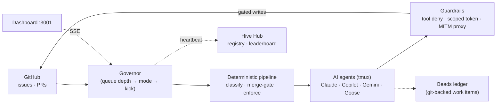

# Hive

[](https://hub.tunaos.org)
[](https://tunaos.org)
[](https://www.bestpractices.dev/projects/14261)
[](LICENSE)

> This repository is a fork of [`hivecommons/hive`](https://github.com/hivecommons/hive)
> that Tuna OS runs for its repositories. Send bugs, features, and security
> reports upstream. See [FORK.md](FORK.md) for scope and details on upstream documents.

AI agent orchestration for open source projects. A Go binary will scan GitHub issues and PRs, classify complexity, and send work to AI agents (Claude, Copilot, Gemini, Goose). The governor will adapt the cadence based on the queue depth.

Hive separates decisions into two layers. A **deterministic pipeline** of shell scripts filters, classifies, and gates merge operations before an LLM receives work. Agents will make judgment calls only: code review, fix design, and PR creation.

## Quick Start

We support two standalone runtimes. **Docker Compose is the default** for this README. **Podman** is a parallel choice, not an experiment. Pick one — both install Hive and its auth gateway on the same port.

| | [Docker Compose](#quick-start-docker-compose) | [Podman](#quick-start-podman) |
| --- | --- | --- |
| Lifecycle | `docker compose up -d` | Quadlet units under systemd |
| Runs as | the Docker daemon | rootful **or** rootless |
| Update path | pull and recreate; optional Watchtower profile | [pinned by digest, with rollback](src/docs/podman-quadlet-update-rollback.md) |

## Quick Start (Docker Compose)

**Prerequisites**

- Docker Engine 24+ with the Compose v2 plugin (`docker compose`, not the legacy `docker-compose`)
- A Linux, macOS, or Windows (WSL2) host on `amd64` or `arm64` — the pre-built images are multi-arch
- `git`, `openssl`, and a GitHub token (PAT or App) for the org you want the hive to work on

```bash
git clone https://github.com/hivecommons/hive.git
cd hive

cp src/hive.yaml.example src/hive.yaml

# src/.env, NOT ./.env. `-f src/docker-compose.yaml` makes `src/` the project
# directory, and that is where Compose reads `.env` from — the same place the
# compose file's own `./hive.yaml` and `./secrets` mounts resolve against. A
# `.env` at the repo root is read by nothing, and since both paths are
# gitignored, neither git nor Compose says so: the hive starts and then 401s on
# every GitHub call, which reads like a bad token rather than an unread file.
echo "HIVE_GITHUB_TOKEN=ghp_..." > src/.env   # classic PAT: repo scope (see src/docs/github-app-setup.md#personal-access-token-pat-scopes)

# REQUIRED. The dashboard's auth proxy enforces this token and refuses to start
# without one, so the gateway on :3001 would proxy to a port nothing is
# listening on. See src/deploy/quadlet/hive.env.example, which is the contract
# for both runtimes.
printf 'HIVE_DASHBOARD_TOKEN=%s\n' "$(openssl rand -hex 32)" >> src/.env

docker compose -f src/docker-compose.yaml up -d
```

The dashboard is at http://localhost:3001. Confirm the port end to end. Do not assume the port answers. The gateway publishes port 3001 even if the proxy behind it is not up:

```bash
curl -sf http://127.0.0.1:3001/api/health     # -> {"status":"ok"}
```

The operator reference documents the pre-built image tag in [src/docs/operator-reference.md#image-provenance-and-tags](src/docs/operator-reference.md#image-provenance-and-tags). The file [`src/deploy/standalone-images.sh`](src/deploy/standalone-images.sh) provides the single source of truth for standalone image references.

To build from source without the pre-built image:

```bash
docker compose -f src/docker-compose.yaml build
docker compose -f src/docker-compose.yaml up -d
```

## Quick Start (Podman)

This deployment uses the same two services as the Compose stack. The services run as systemd units through Quadlet. When `systemctl start` returns, Hive has answered `/api/health`. You do not need or use Docker.

**Prerequisites**

- **Podman 5.0.0+** (ADR-0017 recommends **5.6.0**; the verified floor is unknown — see [the requirements note](src/docs/podman-standalone-quadlet.md#requirements))
- **systemd**, and **cgroup v2** — `podman info --format '{{.Host.CgroupsVersion}}'`
- The **Quadlet generator** at `/usr/libexec/podman/quadlet`. It ships with the distribution `podman` package; a hand-installed podman binary may not carry it.
- **`aardvark-dns`** — `podman info --format '{{.Host.NetworkBackend}}'` should say `netavark`. Without it the gateway starts and cannot resolve `hive`, so `:3001` serves 502s.
- `git`, `openssl`, and a GitHub token (PAT or App) for the org the hive works on

### One command

The script `bin/hive-podman-setup.sh` completes all setup steps: preflights, configuration, four Quadlet units, boot wiring, and gateway checks.

```bash
git clone https://github.com/hivecommons/hive.git
cd hive

export HIVE_DEPLOY_RUNTIME=podman
bin/hive-podman-setup.sh --rootless        # or --rootful
```

The script installs no packages and clones nothing. It is idempotent, never overwrites an existing config without `--force`, and never touches `secrets/`. A failed step stops execution and reports its name. The script does not roll back state, so you can inspect partial state. It also enforces three rules:

- The script reads `dashboard.port` from the unit. The run stops if the config does not match.
- The unit creates the volume, so it carries the ownership labels for `bin/hive-podman-teardown.sh`.
- The directory for secrets receives the correct ownership. The script warns rootless installs when linger is off.

Add `--enable-linger` to enable linger during installation instead of after.

### Or, by hand

Read this section even if you use the script. The comments below document the known traps, and the script enforces the same rules.

The block below is **rootless**. For rootful, set `CONF=/etc/hive`, replace `podman unshare` with the `chgrp` command beside it, install units into `/etc/containers/systemd/` with `sudo`, and drop `--user` from every `systemctl` command.

```bash
# Selects the Podman path. WITHOUT THIS the preflights below exit 0 having
# checked nothing — they default to Docker and skip.
export HIVE_DEPLOY_RUNTIME=podman

git clone https://github.com/hivecommons/hive.git
cd hive

# Engine, root mode, cgroups; then subordinate IDs, graphroot, networking.
# A missing subuid range or cgroup v1 host fails HERE rather than as a start
# that times out five minutes later.
bin/hive-podman-preflight.sh
bin/hive-podman-preflight-ids.sh

CONF=~/.config/hive                       # rootful: CONF=/etc/hive
mkdir -p "$CONF/secrets" && chmod 750 "$CONF/secrets"
podman unshare chown -R 0:1002 "$CONF/secrets"    # rootful: chgrp -R 1002 "$CONF/secrets"

cp src/hive.yaml.example "$CONF/hive.yaml"
# REQUIRED. The example ships 3001 for local source runs; the unit's healthcheck
# probes 3002. Keeping 3001 costs a silent 300-second hang with no container
# left to inspect.
sed -i 's/^  port: 3001$/  port: 3002/' "$CONF/hive.yaml"
# then edit the rest of "$CONF/hive.yaml" for your project

cp src/deploy/nginx.conf "$CONF/nginx.conf"

# Must EXIST, even if every line stays commented out: EnvironmentFile= becomes
# `podman run --env-file`, which fails on a missing file.
cp src/deploy/quadlet/hive.env.example "$CONF/hive.env"
chmod 600 "$CONF/hive.env"
printf 'HIVE_DASHBOARD_TOKEN=%s\n' "$(openssl rand -hex 32)" >> "$CONF/hive.env"
# Classic PAT: `repo` scope (`public_repo` for public-only), plus `workflow` at
# L5/L6 if agent PRs may touch `.github/workflows/`. See
# src/docs/github-app-setup.md#personal-access-token-pat-scopes
printf 'HIVE_GITHUB_TOKEN=%s\n'    'ghp_...'                 >> "$CONF/hive.env"

# Now the host preflight, which checks what the steps above just created:
# SELinux labels on the bind sources, secrets reachability, hive.env, port 3001.
HIVE_SRC_DIR="$CONF" bin/hive-podman-preflight-host.sh

# Pull before starting. The generated ExecStart pulls a missing image itself and
# that pull is spent inside TimeoutStartSec; the Hive image is ~3.8GB.
podman pull ghcr.io/hivecommons/hive:stable

# All four Quadlet units — the gateway will not generate without the network it
# names — plus the plain units that wire the stack to boot (#4478).
install -Dm644 src/deploy/quadlet/hive.container         ~/.config/containers/systemd/hive.container
install -Dm644 src/deploy/quadlet/hive-data.volume       ~/.config/containers/systemd/hive-data.volume
install -Dm644 src/deploy/quadlet/hive.network           ~/.config/containers/systemd/hive.network
install -Dm644 src/deploy/quadlet/hive-gateway.container ~/.config/containers/systemd/hive-gateway.container
install -Dm644 src/deploy/systemd/hive-boot.target       ~/.config/systemd/user/hive-boot.target
install -Dm644 src/deploy/systemd/hive-boot-gate.service ~/.config/systemd/user/hive-boot-gate.service
systemctl --user daemon-reload
systemctl --user enable hive-boot-gate.service

# Starting the gateway pulls Hive, the network and the volume up in order.
systemctl --user start hive-gateway.service
```

The dashboard is at http://localhost:3001. This is the same port as the Compose stack. Hive uses ports 3001 and 3002 internally, and ttyd uses port 7681 inside the container network. Confirm the stack end to end to verify that the gateway resolves the `hive` host on the network:

```bash
curl -sf http://127.0.0.1:3001/api/health     # -> {"status":"ok"}

# Post-install verification. Healthy NOW is not the same as back after a
# reboot: this is what catches rootless Linger=no, which nothing else reports.
bin/hive-podman-lifecycle-probe.sh check
```

`daemon-reload` runs the generator. The setting `[Install] WantedBy=hive-boot.target` inside the units wires them to boot. The service `hive-boot-gate.service` is the real unit, so you must enable it. **Rootless also needs `loginctl enable-linger "$USER"`**, or the user manager will not start at boot. Check with `bin/hive-podman-lifecycle-probe.sh check`, not with `systemctl is-enabled hive.service`.

The boot gate ensures that host boot does not wait on Hive. It starts `hive-boot.target` only after systemd finishes startup. If Hive does not become healthy, it stops at `TimeoutStartSec` and does not stop host boot. Before #4478, a rootful Hive ran inside the boot transaction and blocked boot for up to five minutes. See [Boot persistence](src/docs/podman-standalone-quadlet.md#4-boot-persistence) for details.

**Security posture — pick deliberately.** The shipped unit requests `CAP_NET_ADMIN`, so the egress gate is active by default. If that capability is unavailable, `HIVE_PROXY_ADVISORY_OK=true` in `$CONF/hive.env` starts Hive with the gate **not installed**. Without either setting, Hive exits with code 77 to avoid an unenforced capability model.

| | Enforcing (default) | Advisory (`HIVE_PROXY_ADVISORY_OK=true`) |
| --- | --- | --- |
| **Rootful** | **Supported** | Supported as a deliberate choice, **unenforced** |
| **Rootless** | **Supported** (needs `loginctl enable-linger` to survive reboot) | Supported as a deliberate choice, **unenforced** |

Advisory mode is **not** a weaker grade of enforcement and is **not** a fallback. Agents can bypass the MITM proxy, and Hive does not enforce the ACMM model. See [src/docs/podman-support-matrix.md](src/docs/podman-support-matrix.md) for the full matrix.

To build from source without the pre-built image, build and tag it under the unit name, then start as above:

```bash
podman build -t ghcr.io/hivecommons/hive:stable -f src/Dockerfile .
```

See **[src/docs/podman-standalone-quadlet.md](src/docs/podman-standalone-quadlet.md)** for full installation details. It will cover the search paths for units, step traps, persistence at boot, and measurements in both root modes. See [src/docs/podman-quadlet-update-rollback.md](src/docs/podman-quadlet-update-rollback.md) for update and rollback instructions. For teardown, use `bin/hive-podman-teardown.sh`.

## Kubernetes Deployment

### Prerequisites

- `kubectl` configured for your cluster
- Kubernetes 1.24+
- A StorageClass that supports `ReadWriteMany` (NFS recommended for zero-downtime rollouts)
- cert-manager (for TLS certificates)
- nginx-ingress (for ingress route management)

### Hosted Option

The [Hive Hub](https://hive.hivecommons.dev) provides hosted hives with OAuth-protected dashboards, a public registry, and cross-hive leaderboards. You do not need a cluster. The canonical hub address is now https://hive.hivecommons.dev. The legacy https://hive.kubestellar.io address redirects to it. Use the [hosted hub guide](src/docs/hosted-hub.md) to sign in, request a hosted hive, and finish setup.

If you need to run a private hub, see the [hub deployment guide](src/docs/hub-deployment.md).

### Self-Hosted Deployment

#### 1. Create the namespace

```bash
kubectl apply -f src/deploy/k8s/namespace.yaml
```

Or manually:

```bash
kubectl create namespace hive
```

#### 2. Create secrets

```bash
kubectl -n hive create secret generic hive-secrets \
  --from-literal=HIVE_GITHUB_TOKEN=ghp_... \
  --from-literal=HIVE_DASHBOARD_TOKEN="$(openssl rand -hex 32)"
```

The PAT needs the classic `repo` scope (`public_repo` for public-only repos), plus `workflow` at L5/L6 if agent PRs may touch `.github/workflows/`. Startup does not validate scopes. A token with an incorrect scope will fail later with a generic GitHub 403 error. See [Personal access token (PAT) scopes](src/docs/github-app-setup.md#personal-access-token-pat-scopes).

The dashboard token is an opaque shared secret with no server-side strength check — always generate it with a CSPRNG as above, never a hand-typed value. See [Generate and rotate `HIVE_DASHBOARD_TOKEN`](src/docs/env-vars.md#generating-and-rotating-hive_dashboard_token).

For GitHub App auth (recommended for production), add the private key:

```bash
kubectl -n hive create secret generic hive-secrets \
  --from-literal=HIVE_GITHUB_TOKEN=ghp_... \
  --from-file=gh-app-key.pem=/path/to/key.pem
```

When you set `github.app_id` and `key_file`, the GitHub App will supply permissions for the repository. The PAT serves only as a fallback. See [GitHub App setup](src/docs/github-app-setup.md) for both paths.

#### 3. Create ConfigMap from hive.yaml

```bash
cp src/hive.yaml.example hive.yaml
# Edit hive.yaml: set your org, repos, agents, and governor config

kubectl create configmap hive-config -n hive --from-file=hive.yaml=hive.yaml
```

#### 4. Create PersistentVolumeClaim

Apply the provided PVC manifest:

```bash
kubectl apply -f src/deploy/k8s/pvc.yaml
```

The default PVC will request 10Gi of storage with `ReadWriteOnce`. For zero-downtime rollouts, use an NFS-backed StorageClass with `ReadWriteMany`:

```yaml
apiVersion: v1
kind: PersistentVolumeClaim
metadata:
  name: hive-data
  namespace: hive
spec:
  accessModes:
    - ReadWriteMany
  storageClassName: nfs
  resources:
    requests:
      storage: 10Gi
```

#### 5. Deploy

```bash
kubectl apply -f src/deploy/k8s/deployment.yaml
kubectl apply -f src/deploy/k8s/service.yaml
```

The deployment runs a single replica with liveness and readiness probes on `/api/health`. Resource defaults: 500m CPU / 512Mi memory (requests), 2 CPU / 2Gi memory (limits).

#### 6. Set up Ingress with TLS

```yaml
apiVersion: networking.k8s.io/v1
kind: Ingress
metadata:
  name: hive
  namespace: hive
  annotations:
    cert-manager.io/cluster-issuer: letsencrypt-prod
    nginx.ingress.kubernetes.io/proxy-body-size: "50m"
    nginx.ingress.kubernetes.io/proxy-read-timeout: "3600"
    nginx.ingress.kubernetes.io/proxy-send-timeout: "3600"
spec:
  ingressClassName: nginx
  tls:
    - hosts:
        - hive.example.com
      secretName: hive-tls
  rules:
    - host: hive.example.com
      http:
        paths:
          - path: /
            pathType: Prefix
            backend:
              service:
                name: hive
                port:
                  name: dashboard
```

Configure long timeouts for SSE stream connections to the dashboard.

#### Quick apply (all manifests)

```bash
kubectl apply -f src/deploy/k8s/namespace.yaml
kubectl -n hive create secret generic hive-secrets \
  --from-literal=HIVE_GITHUB_TOKEN=ghp_...   # classic PAT: repo scope — see src/docs/github-app-setup.md#personal-access-token-pat-scopes
kubectl create configmap hive-config -n hive --from-file=hive.yaml=hive.yaml
kubectl apply -f src/deploy/k8s/pvc.yaml
kubectl apply -f src/deploy/k8s/deployment.yaml
kubectl apply -f src/deploy/k8s/service.yaml
```

### Ports

| Port | Purpose |
|------|---------|
| 3001 | Dashboard (supports auth token) |
| 3002 | Internal API |
| 7681 | ttyd web terminal |

### Volumes

| Mount Path | Purpose |
|------------|---------|
| `/etc/hive/hive.yaml` | Configuration (read-only, from ConfigMap) |
| `/data` | Persistent state: metrics, beads, logs |
| `/secrets` | GitHub App key and other secrets (read-only) |

## Configuration

All runtime configuration lives in a single `hive.yaml`. Hive will interpolate environment variables with `${VAR}` syntax.

For details, see:
- [src/hive.yaml.example](src/hive.yaml.example) for the configuration reference
- [src/docs/env-vars.md](src/docs/env-vars.md) for environment variables
- [src/docs/agent-configuration.md](src/docs/agent-configuration.md) for agent configuration
- [src/AGENT-DEFINITION.md](src/AGENT-DEFINITION.md) for agent YAML definitions
- [src/docs/supervisor.md](src/docs/supervisor.md) for the supervisor agent
- [src/docs/telemetry.md](src/docs/telemetry.md) and [src/docs/operations.md](src/docs/operations.md) for observability and operations
- [docs/backend-setup.md](docs/backend-setup.md) for CLI backends
- [docs/inference-backends.md](docs/inference-backends.md) for model gateways
- [docs/migration-v1-v2.md](docs/migration-v1-v2.md) for v1 to v2 migration
- [src/docs/migration-v2-v4.md](src/docs/migration-v2-v4.md) to upgrade from v2 to v4

The deterministic shell pipeline at the top level uses `config/hive-project.yaml.example`. See [config/README.md](config/README.md) before you run top-level `bin/` scripts directly.

```yaml
project:
  org: your-org
  repos:
    - repo-one
    - repo-two
  primary_repo: repo-one
  ai_author: your-bot-user

agents:
  scanner:
    enabled: true
    backend: claude
    model: claude-sonnet-4-6
    beads_dir: /data/beads/scanner
    clear_on_kick: true

governor:
  eval_interval_s: 300
  modes:
    surge:
      threshold: 20
      scanner: 15m
      reviewer: pause
    busy:
      threshold: 10
      scanner: 15m
      reviewer: 1h
    quiet:
      threshold: 2
      scanner: 15m
      reviewer: 45m
    idle:
      threshold: 0
      scanner: 15m
      reviewer: 15m

hub:
  enabled: true
  url: https://hive.hivecommons.dev
  contribute:
    enabled: true
```

### GitHub Auth

Use a personal access token or a GitHub App:

```yaml
github:
  token: ${HIVE_GITHUB_TOKEN}
```

```yaml
github:
  app_id: 12345
  installation_id: 67890
  key_file: /secrets/gh-app-key.pem
```

## ACMM Levels

Hive uses the **Capability Maturity Model** (ACMM) for AI. Six ACMM levels will control what actions agents can do:

| Level | Name | Agents | What agents can do |
|-------|------|--------|-------------------|
| L1 | Inception (Assisted) | 2 | Interactive advisor and project inception. Advisory beads only. |
| L2 | Advisory (Instructed) | 5 | Observe and report findings as dashboard beads. No GitHub interaction. |
| L3 | Quality-Gated (Measured) | 6 | Quality agent opens issues and hold-gated PRs. Others remain advisory. |
| L4 | Security-Aware (Adaptive) | 7 | All agents file issues. Quality, sec-check, and CI open hold-gated PRs. |
| L5 | Semi-Autonomous (Semi-Automated) | 9 | All agents open hold-gated PRs. Humans batch-review and approve. |
| L6 | Fully Autonomous | 10 | Agents open PRs and auto-merge on green CI. No hold label required. |

Each level defines per-agent **policy modes**: advisory (observe only), measured (file issues), holdgated (PRs with hold label), or full (auto-merge). See `src/docs/acmm-policy-matrix.md` for the full matrix. Browse the [documentation index](src/docs/README.md) for operations, contributor relay, snapshots, health checks, and design guides.

Operational references from the repository root include [hub disaster recovery](docs/HUB_DISASTER_RECOVERY.md), [federation design](docs/federation-design.md), [outreach antispam policy](docs/outreach-antispam.md), [macOS deployment notes](docs/macos.md), and [backend setup](docs/backend-setup.md). Worked examples live under [examples/](examples/README.md), including [KubeStellar skill and campaign configs](examples/kubestellar/README.md), [notes on SQLite state backends](examples/sqlite-state.md), and [ACMM runtime fragments](examples/acmm/README.md).

## Architecture

Hive runs as a single container with three long-lived processes:

- **Go binary** (`hive`, `:3002`) — the brain. Runs the governor loop, agent manager, dashboard API, GitHub MITM proxy, hub heartbeat, and token metrics.
- **Node.js proxy** (`:3001`) — the public front door. Reverse-proxies to the Go API with auth and path-rewrite, and streams SSE/WebSocket to the dashboard and web terminal.
- **ttyd** (`:7681`) — web terminal onto the agent tmux sessions.

The governor will evaluate the queue depth on a configurable interval. It switches between four modes (`SURGE`, `BUSY`, `QUIET`, `IDLE`), each with per-agent cadences. A deterministic pipeline (Go + shell) filters, classifies, and gates all GitHub work before Hive kicks an agent. Three independent layers will enforce what each agent can do based on its ACMM mode: CLI tool denial, least-privilege tokens, and a network-level MITM proxy.


```mermaid
flowchart LR
    github["GitHub<br/>issues · PRs"] --> gov["Governor<br/>(queue depth → mode → kick)"]
    gov --> pipe["Deterministic pipeline<br/>classify · merge-gate · enforce"]
    pipe --> agents["AI agents (tmux)<br/>Claude · Copilot · Gemini · Goose"]
    agents --> guard["Guardrails<br/>tool deny · scoped token · MITM proxy"]
    guard -->|"gated writes"| github
    agents -.-> beads["Beads ledger<br/>(git-backed work items)"]
    gov -.->|"heartbeat"| hub["Hive Hub<br/>registry · leaderboard"]
    dash["Dashboard :3001"] -.->|"SSE"| gov
```

**See [src/docs/architecture.md](src/docs/architecture.md) for the full reference architecture.** It details the process model, governor loop, pipeline, guardrails, ACMM, beads, and hub-and-spoke design. Operator safety references include [trajectory review](src/docs/trajectory-review.md), [dashboard health checks](src/docs/health-checks.md), [sandbox guardrails](src/docs/sandbox-isolation.md), [manual provision](src/docs/manual-provisioning.md), [cross-cluster migration](src/docs/cross-cluster-migration.md), and [config layers](src/docs/config-layering.md). The dashboard API reference is available at [dashboard/openapi.json](dashboard/openapi.json).

See also the [roadmap](ROADMAP.md) with the [detailed plan](src/docs/roadmap.md), the [upgrade guide](UPGRADE.md), the [documentation index](src/docs/README.md), and the [landscape comparison](src/docs/landscape.md).

## Terminal dashboard

`hivectl tui` provides a terminal view of the fleet in a live 2×2 grid. It displays agents, governor status, token spend, and activity. It supports pause/resume, model apply, kick, and ACMM level actions. It is **not a second Hive runtime**: it is another client of the same dashboard API at `:3001` over the same auth token and SSE stream.

```bash
export HIVE_DASHBOARD_TOKEN="..."
hivectl tui
```

See [`hivectl tui` in the command reference](src/docs/hivectl.md#tui--live-terminal-dashboard) for keybindings, pane cadence, and v1 boundaries. See [the design record](src/docs/design/tui.md) for design decisions.

## Tuna OS deployment

Tuna OS runs this fork as a fleet of hives behind one hub. Each host below
answered `curl` on 2026-09-10:

| Host | Role | Check |
| --- | --- | --- |
| [hub.tunaos.org](https://hub.tunaos.org) | Hub. Its index page lists the hives. | `GET /` returns `200` |
| [reef.tunaos.org](https://reef.tunaos.org) | Hive | `GET /api/health` returns `{"status":"ok"}` |
| [school.tunaos.org](https://school.tunaos.org) | Hive | `GET /api/health` returns `{"status":"ok"}` |
| [hive.tunaos.org](https://hive.tunaos.org) | Hive; the hub index does not list it | `GET /api/health` returns `{"status":"ok"}` |

A hive answers `401` on `/` until you supply the dashboard token from the Quick
Start, so use `/api/health` to see whether a hive is up.

- Website: [tunaos.org](https://tunaos.org)
- Organization: [github.com/tuna-os](https://github.com/tuna-os)
- Fork scope and upstream: [FORK.md](FORK.md)

## Contribute to a Hive

Community members can contribute compute to any hive through **ClankeR**, the contributor relay. It hands tasks from a hive's backlog to the CLI agent on your local machine:

```bash
brew install just gh
git clone https://github.com/hivecommons/hive && cd hive
just contribute-setup claude
just contribute-hive
```

Supported CLIs: Claude Code, GitHub Copilot, Pi, Goose, Bob. Contributors start as newcomer (rate-limited) and auto-promote based on completed tasks. Your credentials never leave your machine.

A relay can subscribe to multiple hives with comma-separated `HIVE_HUB` and matching `HIVE_REGISTRATION_TOKEN` values. Operators can delegate roles for selected spokes through **Acting as** / `HIVE_AGENT_ROLE`. See [src/docs/contributor-relay.md](src/docs/contributor-relay.md) and [src/docs/contributor-trust-and-roles.md](src/docs/contributor-trust-and-roles.md).

See the [contribute page on Hive Hub](https://hive.hivecommons.dev) for details.

## Contributing

See the [Hive Hub](https://hive.hivecommons.dev) to browse registered hives, view leaderboards, and find hives that accept contributions.

To contribute to Hive itself, see [the contribution guide](CONTRIBUTING.md) and open issues or PRs on this repository.

The file [CHANGELOG.md](CHANGELOG.md) records recent user-visible changes.

## Security

Please see [SECURITY.md](SECURITY.md) for the vulnerability disclosure process. Do not report security vulnerabilities through public issues or pull requests.

---

Apache 2.0
